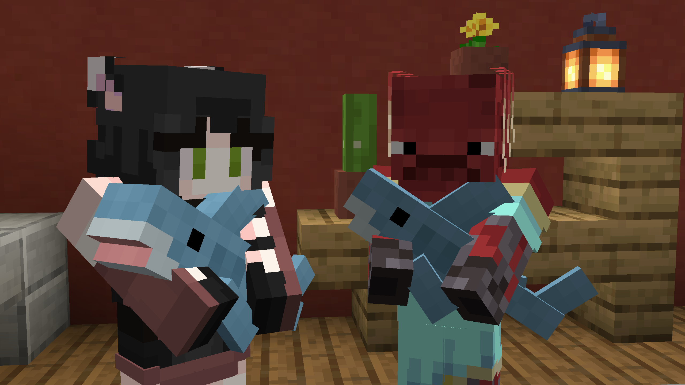

# Changed view model from hand

less annoying due to smol size, but still pwetty shawk. nothing unusual. recommend to everynyane 2b2t pwpers
(all what i did is just rummaged through .txt files and changed sizes LOL)

# Blåhaj of Undying

This is a client-side version of [Blåhaj](https://modrinth.com/mod/blahaj) by Hibi. This version replaces the totem of undying model and name instead of creating a new item for our beloved Blåhaj, who you can now cuddle even on vanilla servers!

## Content

Only the original Blåhaj exists in this version, other variants added by the original mod have not been mapped to any vanilla items.

## Why is this not a resource pack?

Because resource packs cant recreate the cuddly arms animation. That is all.

## License

Like the original, this mod is licensed under the [Unlicense](./LICENSE). Feel free to learn from it and incorporate it in your own projects.

The icon of this project is the Blobhaj by Heatherhorns, and is licensed under a [Creative Commons Attribution 4.0 International License](http://creativecommons.org/licenses/by/4.0/).
